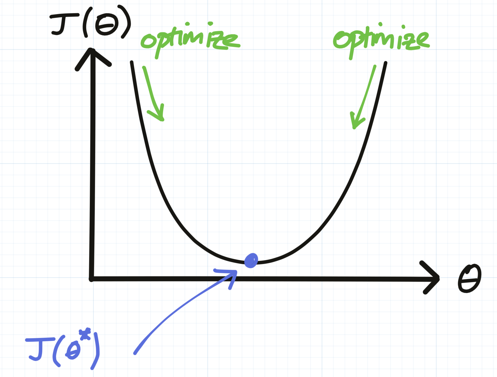
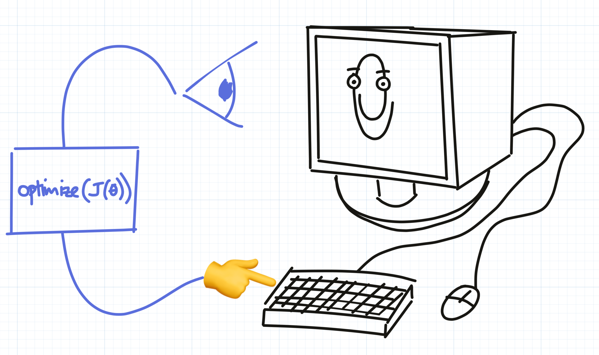
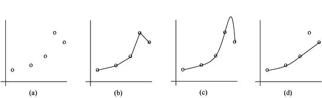

Optimization is All You Need (Part 1: Digital)
==============================================

Cognitive scientists and AI researchers spend most of their time trying to figure out how brains or machines can learn, perceive and act within their respective environments.

Learning is a fundamental feature of the natural world but a fairly recent addition to the human-engineered one. Computers are a mature technology (we know a lot about how to build them and we can do it very cheaply) and it’s tempting to think of them as “intelligent” machines. But even though a lot has changed in recent years, they are still by and large just static data processing instruments.

When you stop to think about it, until ~5-10 years ago - i.e. before [AlexNet](https://en.wikipedia.org/wiki/AlexNet) brought AI back to life, computers really did almost _zero_ learning, in the naturalistic sense of the word. When I talk about learning, what I really mean is the process of automatic adaptation to some signal from / interaction with the environment (environment = _the world outside the computer_).

“Hang on”, you might be thinking. “But what about [_Clippy_](https://en.wikipedia.org/wiki/Office_Assistant)?”. That loveable rapscallion (/sinister creep). He was intelligent, right? It’s true that _Clippy_ could offer suggestions to help your workflow by, for example, formatting your document as a letter when you start typing “Dear so and so…”. And yes, it’s true that some software can ‘learn’ our user preferences in a very narrow sense. But these are not learned behaviours. If _Clippy_ were really intelligent, he would learn after the first few times you hide him that his help just isn’t wanted. Sure, it was cute the first or second time. But really _Clippy_, get the hint.

In fact, I’d wager that almost all “smart” features operate by following a set of pre-programmed rules that might follow some logic like, “if user does xxx three times, then do yyy”.

In the 80s, artificial intelligence researchers thought that this was a good route to building intelligent machines. The idea was that, if we simply write enough rules based on conditional logic, these “[expert systems](https://en.wikipedia.org/wiki/AI_winter#The_collapse_of_the_LISP_machine_market)” would eventually become knowledgeable enough to form robust and useful thinking and acting machines.

This is broadly the “Chinese Room” thought experiment proposed by the computer scientist John Searle. It says that intelligence is nothing but a big rule book. Searle asks us to imagine a machine that is capable of “understanding” the Chinese language, by which he means that, given some Chinese symbols as input (e.g. some question) it would produce some useful symbols in return (e.g. an answer). But it turns out that this machine is just a big input / output table, with entries for _looottsss_ of different questions.

Searle’s intention was to raise the question of whether a system based only on fixed rules could be regarded as “intelligent” - i.e. whether the system could in fact “understand” Chinese in the way you and I might think we “understand” the English in this article[1](http://www.talfanevans.co.uk/posts/optimization_is_all_you_need/optimization_is_all_you_need/#fn:1).

But that’s a bit of an open-ended and philosophical question, certainly not one we’re going to get to the bottom of here. A more testable engineering question is - could a system built on rules emulate intelligence in a passable way? It seems that the answer from the “expert systems” experiment is a tentative no. The common failure mode among these approaches was that, although some systems could perform well in small and constrained scenarios, they would fail to scale up - or “generalize” to new task outside of the types of data that they were engineered to work with. In a word, they were brittle. And no matter how big the rule book was made, the problem wouldn’t go away.

 

This isn’t to say that “expert” or “rule-based” systems aren’t _useful_. They are - as long as either:

*   The task that they’re solving won’t change (e.g. the operating system on your washer/dryer).
*   The system can be constantly monitored and updated (by a human / team of humans) to adapt to task changes.

Note that the latter example even describes modern computers. Modern computers are still largely just very powerful and complicated “expert systems”, built by very clever engineers within strict operating constraints. And these systems can do amazing things. But even computers need regular software updates because the environment in which they’re operating is constantly changing, which means bugs, suboptimal performance or simply an outdated experience with respect to the desires of the user (you and I).

So what’s changed? What’s changed is that machine learning and AI have taught us some very general and powerful principles for building systems that can adapt, in the truest sense of the word.

Optimization is all you need
----------------------------

Did you ever wonder what was the use of learning calculus in school? Unless you work in a technical field, you’ve probably never since had to differentiate a curve and find its minimum:

 

Well I’ll tell you who/what is doing this: modern machine learning systems, _almost all of the time_. If you had to summarize modern machine learning, AI (and “big data”), it would essentially boil down to:

*   A cost function $J(\theta)$, which takes some parameters $\theta$. Think of $\theta$ as a list of things that could be changed in your system. For example:

$$
θ_{\text{Clippy}}
= [\theta_0, \theta_1]
= [\text{probability of appearing}, \text{smirkiness}]
$$

*   An optimizer, whose only job is to minimize the cost function. I.e. find the parameters $\theta$ that, in this case, make $J(\theta)$ as big or as small as possible. It might for example measure user happiness as a function of the parameters like so:

$$
J_{\text{Happiness}}(\theta_{\text{Clippy}}) = - (\theta_0^2 + \theta_1^2)
$$

Hopefully, the optimizer would discover the optimal parameters $θ^* = \text{arg max}_{\theta} J(θ) = [0, 0]$ (don’t show your face around here again, \*Clippy\*).

A cost function could be anything. Often it’s something like minimizing the “error” of some prediction. Predicting what products people want to buy, so that they can be rady to ship from the warehouse. Predicting what the weather will be like three days from now so that we can start marinading for the barbecue. A slightly different flavour of AI is concerned with the opposite thing - maximizing (not minimizing) a “reward function”. Programming a computer to play chess, or [Go](https://deepmind.com/research/case-studies/alphago-the-story-so-far), or to collect gold coins in an [_Atari_ game](https://www.cs.toronto.edu/~vmnih/docs/dqn.pdf).

But whether you’re talking about maximimzing or minimizing, you’re still just **optimizing**. Finding the point of inflection in your $J(\theta)$ curve.

The crucial difference between a system that is able to optimize for some function and a system with pre-programmed rules, is that the optimizable system can in theory reach an infinite number of different conclusions based on the interactions it has with the environment. And you won’t find these conclusions written anywhere in the code, at least, not in any spoken language. This is broadly not true of expert systems, which are essentially just big decision trees. The leaves may be many, but they’re finite.

An adaptive digital world, or maybe not
---------------------------------------

Ok, so the new machine learning revolution happened already, 10 years ago right? And all those points about computers being pretty stupid don’t hold anymore:

*   Gmail learns which emails I don’t read and puts them in the spam folder ✔️
*   My phone learns common words I type that aren’t in the dictionary ✔️
*   My photo manager automatically detects and groups photos by the people that they show ✔️
*   …?

So I’m having a hard time coming up with more examples. It’s easy to think that AI has already transformed our lives completely. Actually, AI is _very far_ from being embedded in the world at anywhere near the kind of granularity that it could be. A few counter examples:

*   Almost none of the software I use learns my preferences. For example, I find particular layouts/ views in MS PowerPoint more useful than others. I almost never use feature xxx, and almost always use feature yyy. In general, UIs are pretty dumb.
*   My bike lights never turn themselves off if I forget to, but am not using them. And inevitably run out of battery when I come to use them next time.

Ok there’s one reason that this “adaptive” property isn’t more ubiquitous in digital systems. In some cases, adaptivity is bad. We sometimes want things to behave predictably. I definitely don’t want my bike lights to decide to turn off while I’m cycling along a dark street at night, because it’s past Talfan’s bedtime and he’s almost definitely not cycling right now.

But the real reason is that actually, it’s pretty hard to design these systems to work well. It’s not yet become second-nature to industry and almost all the good examples of where this adaptivity has been successful is in well engineered commercial applications.

And in many of these examples, the adaptivity is the _core_ feature of the product. _Netflix_ is great because it can predict (and to some extent affect) what we like and choose to watch. _Google_ enjoys 90% of the search market because, on average, it just seems to know what you mean when you search for [“cat video jump sail”](https://letmegooglethat.com/?q=cat+video+jump+sail&l=1), a little better than _Bing_ or _Yahoo_ does.

But the near future is coming 🚀, and it will be different. Adaptivity will be a basic principle of the digital experience. And static, hand-engineered behaviour will feel like ancient technology. There will come a time for all of us when we will become frustrated with our mobile phones which, when we jab at their screens without real thought or conviction, don’t show us the content that our brains were expecting to see. Somehow, they should just know. Imagine those poor people of the early 21st century, who still had to use keyboards to write blog posts! Those poor, poor bloggers (link to [Patreon](http://www.talfanevans.co.uk/maybeireallyshouldgetapatreonpage) page).

Adaptivity as digital second nature
-----------------------------------

So what would this look like? How will we move from having to engineer adaptivity as a feature, to having everything we design be natively adaptive? I can’t answer that in this blog post, but a high-level answer will be to stop writing code and to start writing cost-functions (and then optimize them to [write code](https://www.technologyreview.com/2020/07/29/1005768/neural-network-similarities-between-programs-help-computers-code-themselves-ai-intel/)).

And what would be a good cost-function? This will depend on the application, but a good general purpose candidate is to design your system to predict the environmental stimuli it’s going to receive and adjust in such a way that it prevents those stimuli from happening in future.

This might seem counterintuitive, but consider these examples:

*   My phone regularly autocorrects my name (Talfan), to one of either “teflon” or “tailfin”. I (usually) correct this, which is annoying to have to do. So, the goal of an adaptive autocorrecter program would be to modify its behaviour so as to prevent me from having to correct this in future. I.e. minimize the number of “interactions” I have with the interface.
*   One could also measure “interactions” not in terms of discrete events, but as a continuous quantity, i.e. “time spent interacting”. This is a very broad principle - in general, I would like to spend less time filling out tax returns. If my computer could figure out how to do this for me, it would prevent me from interacting with it so much in future.

**Yes** - I am saying that, given an appropriate cost-function and optimizer, it is theoretically possible to have a machine generate the entire source code of a computer’s operating system. One experiment that I’m sure we will see achieved soon is to have a deep neural network learn an _Atari_ (or _Windows 95_?) emulator by interacting via the keyboard / mouse and observing the screen outputs. I haven’t thought enough whether this would even be a surprising / notable advance.

 

There are a few problems. Firstly, systems will need to have the physical capability to sense the outcomes of their behaviour. This is doable in most digital systems which have an input interface. But more broadly, there may just not be enough _signal_ or _bandwidth_ in these channels. For example, _Netflix_, as good as its reccomender system is, doesn’t yet have the sensing capability to hear you crying (but maybe _Alexa_ does) or smell your tears, so it won’t suggest that you watch \*_insert feel-good smash-hit romcom of the year_\* if you’re having a tough time. It will probably still suggest you watch Louis Theroux’s _Altered States_.

Broadly speaking, the above describes the problem of being able to evaluate whatever cost-function you’ve defined. Defining the right cost-function is also hard. But, depending on the context, it can also be a very _human_ problem. It’s entirely possible to imagine a future in which algorithmic techniques could be totally defunct as part of a modern maths curriculum, if we have good general purpose ways of doing those computations for us. What will become more important is that core scientific skill of being able to figure out what are the right questions.

The cost-function will represent those question - i.e. how to define an appropriate measure of satisfaction with respect to the task at hand. The answering would then be left to the optimizer. To paraphrase [Yuval Noah Harari](https://www.wired.co.uk/article/yuval-noah-harari-extract-21-lessons-for-the-21st-century), before rushing to push your kid to become a computer programmer, consider whether the physical skill of coding will be valuable in a future where it can be done much faster and more efficiently by a machine. What will always be important is the ability to think critically about a problem; to be able to understand a goal or objective and figure out how to measure whether it’s being achieved (which is what I think Harari calls ‘resilience’).

But an equally big problem, which is the day-to-day concern of most of AI research, is how can we optimize that cost-function in a very reliable and general way?

Inductive biases
----------------

Finding the minimium of the curve by finding the optimal parameters $\theta^*$ is in many cases a completely hopeless problem. Think about how you would go about deciding how best to lay the table for dinner. If you have CCC pieces of cutlery and an equal number of spots on the table in which you could place them (e.g. _spoon - fork - plate - knife - … - fishknife?_), then there are $N! = N(N−1)(N−2)…(1)$ possible ways to do it. For 6 pieces of cutlery that’s 720 possible permuations. And that’s just one place setting!

This is a type of optimization, where our cost-function is the overall ease with which our guests will be able to tackle their dinners. If you misallocate the spoons, someone’s going to have get creative with their fork when the soup course comes. Which could be messy. Which can also be factored into you cost function.

So where to start? Well luckily, we’re saved by having some kind of domain knowledge. We know that if we place a plate at one setting, then we’ll also need a glass instead of another plate. Nobody’s likely to need four forks. So in practice, we just have to search through the likely combinations - each place setting should have at least a knife, fork, plate and some kind of spoon.

This domain knowledge applies to the cooking as well. Most of us don’t think “_hmm, maybe I’ll roast the rest of the muesli and serve it with pesto and spring greens_”, because that would be bonkers. And if we did, we’d spend a lot of time thinking through crazy combinations, most of which would suck. Instead, we’re most of us more concerned with whether that wine will go with fish, etc.

In short, we know ahead of time which are the likely solutions to consider and explore those first. AI researchers call these intuitions / helpful constraints “inductive biases”. Finding the right inductive biases is arguably _all_ of optimization. Think of inductive biases as reflecting some inherent structure in the problem you’re trying to solve. If we always had the right inductive bias, we could solve these problems in an instant. But the problem is finding them.

Luckily, in nature there is a lot of structure that is reusable. A very useful one is that, in natural images, visual features (“motifs”) tend to be repeated across space. For example, you’re likely to find very similar looking trees in different parts of a woodland photograph. What this means for an algorithm whose task is to try to classify between woodlands and human faces is that, rather than having to learn to look for an image of a tree in a particular location in a photograph, it only needs to be able to find one tree (anywhere) to know that it’s a woodland. In terms of permutations, this is the different between evaluating `(tree_A at position 1) OR (tree_B at position 2)` and `tree at position (1 or 2)`. It needs half the memory in the second case, so the search space is dramatically reduced. This makes the _learning_ problem much easier.

This kind of bias is called “translation invariance”, since the features that our algorithm is learning to detect can be found anywhere in the image. A more famous example is [_Occam’s Razor_](https://en.wikipedia.org/wiki/Occam%27s_razor), which says that you should try to find the minimally complex model that can explain your data before trying out the fancy ones.

  

 <em>Which is the right fit: b), c) or d)?</em>
    

But there is always a cost to using any inductive bias. For example, if it’s actually true that a feature only ever appears at a specific location in an image (e.g. a mouth is always near the bottom of a face, assuming the portrait is the right way up), then you’re wasting your time by searching people’s foreheads for mouths.

This is called the “[no free lunch theorem](https://en.wikipedia.org/wiki/No_free_lunch_theorem)”. What is says is that there is no _one_ master algorithm that will always perform best on every task. Instead, every task is different and there will always be some specialized algorithm (with a specialized inductive bias) that will perform better than the others.

Inductive biases are often called “priors” in the psychology / economics literature, but they mean the same thing. If you have a strong prior against liking pineapple on pizza, it’s going to take a lot of convincing (and maybe the promise of a trip to Hawaii) to make you change your opinion. This is probably useful - you tried it one time and you didn’t like it. Why would you waste time, effort and a perfectly good opportunity to eat your pizza of choice, if you’re going to come to the same conclusion?

So, in this future where our software is designed by optimization of a cost-function, there will still be USP and IP for industry leaders who can identify useful inductive biases. Because if they do, they’ll be able to design products much more efficiently and more cheaply than their competitors.

Cranking the lever
------------------

If everything were that simple, we’d be [in the future](http://www.talfanevans.co.uk/posts/optimization_is_all_you_need/optimization_is_all_you_need/www.talfanevans.co.uk/posts/patrick_collison_desiderata) already. But in practice, for lots of real world problems either:

*   The priors exist, but we have so little data relative to the complexity of the problem that there’s no hope of being able to find them.
*   The priors really don’t exist. Like predicting which card is picked randomly from a well shuffled deck (without replacement[2](http://www.talfanevans.co.uk/posts/optimization_is_all_you_need/optimization_is_all_you_need/#fn:2)).

What do we do in these cases? Well, we can always just [shut up and calculate](https://www.math.columbia.edu/~woit/wordpress/?p=9649). This would mean for example, doing a “brute force search” over all possible answers (if they’re finite), or doing some very basic form of optimization with no problems-specific structure (i.e. your algorithm has a “flat” or uniform prior).

The funny thing is that the current-state-of-the-art in optimization is dominated by a very standard toolset. Almost all methods are based on a flavour of something called [“gradient descent”](https://en.wikipedia.org/wiki/Gradient_descent)[3](http://www.talfanevans.co.uk/posts/optimization_is_all_you_need/optimization_is_all_you_need/#fn:3). The basic idea, which we alluded to earlier when we talked about finding the minimum of our $J(\theta)$, is to always try to head “downhill” (to find a minimum), until you can’t go downhill any more. Then, you stop, find a nice rock to sit on, open your lunchbox and consider whether to hike over that big mountain in the distance to get to the next valley (because that valley might be lower - remember we’re trying to get to the lowest point in this convoluted analogy[4](http://www.talfanevans.co.uk/posts/optimization_is_all_you_need/optimization_is_all_you_need/#fn:4)).

The types of cost-functions that we often optimize are also more-often than not quite simple. For example, the ‘squared-error’ loss is really useful when you want to make the absolute value of some quantity really small without making it negative. For example, you want to minimize the number of answers nnn you get wrong $J(n) = \frac{n}{N}$​. You could make this _infinitely_ small by making nnn an infinitely large negative number like $n = -\infty$, but that wouldn’t make any practical sense. So instead you minimize $J(n) = (\frac{n}{N})^2$.

What’s really interesting is that these types of mathematical designs often have physical analogues in the real world. That is to say - the types of problems we’re interested in solving with AI are often identical to problems that are being solved by physical systems, _almost all of the time_.

So what if we could, instead of building computing systems, just “port” our problems into the real world and have nature solve them for us? This is the very cool idea of [natural computing](https://en.wikipedia.org/wiki/Natural_computing).

Which you can read about in the next post [here](http://www.talfanevans.co.uk/posts/optimization_is_all_you_need/optimization_is_all_you_need/www.talfanevans.co.uk/posts/building_an_adaptive_physical_world) (when it’s written).

* * *

1.  I hope. [_Grammarly_](https://www.grammarly.com/), please just let me watch _YouTube_ in peace… \*_shakes fist_\*). [↩︎](http://www.talfanevans.co.uk/posts/optimization_is_all_you_need/optimization_is_all_you_need/#fnref:1)
    
2.  If the drawing process is truly random - in practice, we use “pseudorandom” number generators which rely on some physical and arguably deterministic process. But even if so we’d be pushed _way_ into the first regime. [↩︎](http://www.talfanevans.co.uk/posts/optimization_is_all_you_need/optimization_is_all_you_need/#fnref:2)
    
3.  Other optimization methods are available and competitive and/or better in some cases. Remember the _no free lunch theorem_? E.g. [evolutionary methods](https://towardsdatascience.com/deep-neuroevolution-genetic-algorithms-are-a-competitive-alternative-for-training-deep-neural-822bfe3291f5). But broadly, the community is mostly using gradient descent. But well done for reading this footnote - as the saying goes, “curiosity never killed the cat”. [↩︎](http://www.talfanevans.co.uk/posts/optimization_is_all_you_need/optimization_is_all_you_need/#fnref:3)
    
4.  Yep, I think we just arrived 😐. [↩︎](http://www.talfanevans.co.uk/posts/optimization_is_all_you_need/optimization_is_all_you_need/#fnref:4)
